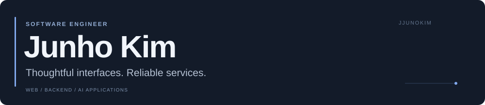
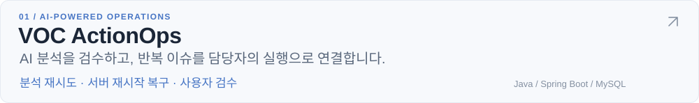
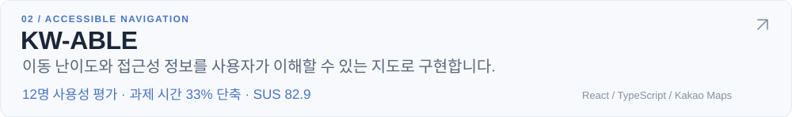
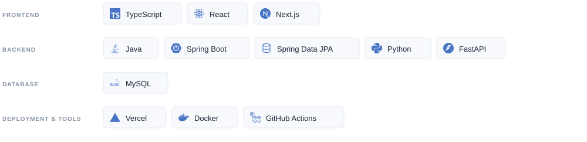

<picture>
  <source media="(prefers-color-scheme: dark) and (max-width: 1199px)" srcset="assets/header-dark-mobile.svg">
  <source media="(prefers-color-scheme: light) and (max-width: 1199px)" srcset="assets/header-light-mobile.svg">
  <source media="(prefers-color-scheme: dark)" srcset="assets/header-dark.svg">
  
</picture>

사용자 경험과 데이터 흐름을 함께 설계합니다.

 

### Selected work

<a href="https://github.com/JJUNOKIM/voc-actionops">
<picture>
  <source media="(prefers-color-scheme: dark) and (max-width: 1199px)" srcset="assets/voc-dark-mobile.svg">
  <source media="(prefers-color-scheme: light) and (max-width: 1199px)" srcset="assets/voc-light-mobile.svg">
  <source media="(prefers-color-scheme: dark)" srcset="assets/voc-dark.svg">
  
</picture>
</a>

<a href="https://github.com/JJUNOKIM/KW-ABLE-client">
<picture>
  <source media="(prefers-color-scheme: dark) and (max-width: 1199px)" srcset="assets/kw-dark-mobile.svg">
  <source media="(prefers-color-scheme: light) and (max-width: 1199px)" srcset="assets/kw-light-mobile.svg">
  <source media="(prefers-color-scheme: dark)" srcset="assets/kw-dark.svg">
  
</picture>
</a>

 

### Tech stack

<picture>
  <source media="(prefers-color-scheme: dark) and (max-width: 1199px)" srcset="assets/stack-dark-mobile.svg">
  <source media="(prefers-color-scheme: light) and (max-width: 1199px)" srcset="assets/stack-light-mobile.svg">
  <source media="(prefers-color-scheme: dark)" srcset="assets/stack-dark.svg">
  
</picture>

 

More work 
[슬기로운 금융생활](https://github.com/attack-on-lion/slgm-client) &nbsp; · &nbsp; [멋쟁이사자처럼 홈페이지](https://github.com/LikeLion-Kwangwoon-Univ-13/homepage-client)
